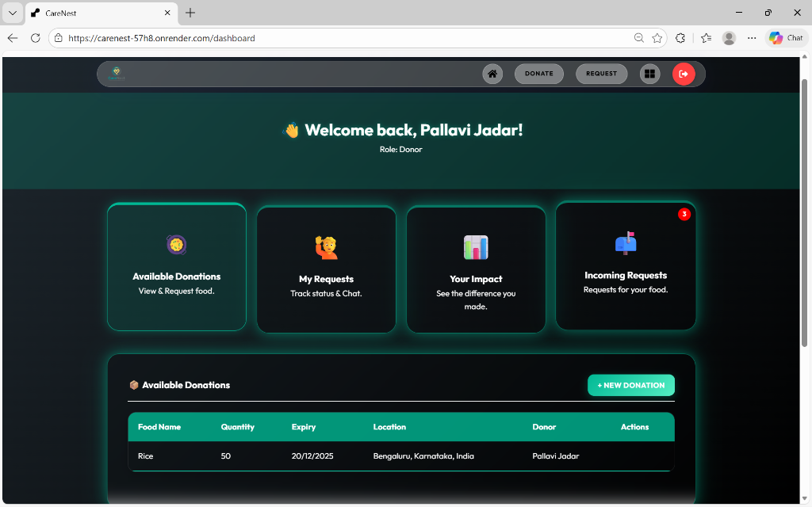

# 🕊️ CareNest: Food Redistribution Platform

**Reducing Waste, Feeding Communities.**

CareNest is a full-stack MERN application designed to connect food donors (individuals/restaurants) with people in need. It streamlines the process of donating surplus food and requesting assistance, ensuring that no good meal goes to waste.

🚀 **[View Live Demo](https://carenest-57h8.onrender.com)**

---

## 📸 Preview


*Modern, responsive dashboard for managing donations and requests.*

---

## ✨ Key Features

- 👤 **Multi-Role Dashboards**: Specific views for Donors, Requesters, and Administrators.
- 🥘 **Easy Donation**: Fast submission process for food items with quantity and expiry tracking.
- 🙋 **Smart Requests**: Requesters can browse available food and send instant requests.
- 💬 **Real-time Chat**: Secure messaging between donors and requesters to coordinate pickups.
- 📊 **Impact Tracking**: Users can see how many meals they've contributed to the community.
- 📱 **Mobile-First Design**: Fully responsive UI built with glassmorphism aesthetics.
- 🔒 **Secure Auth**: JWT-based authentication and restricted administrative access.

---

## 🛠️ Tech Stack

- **Frontend**: React.js, Vite, Axios, React Router, React Icons.
- **Backend**: Node.js, Express.js.
- **Database**: MongoDB Atlas (NoSQL).
- **Authentication**: JWT (JSON Web Tokens) & Bcrypt.js.
- **Styling**: Vanilla CSS (Custom Glassmorphism Design).
- **Hosting**: Render (Web Service) & MongoDB Atlas (Database).

---

## 🚀 Getting Started (Local Development)

### Prerequisites
- Node.js (v16+)
- MongoDB Atlas account or local MongoDB

### Installation

1. **Clone the Repo**
   ```bash
   git clone https://github.com/PallaviJadar/CareNest.git
   cd CareNest
   ```

2. **Setup Backend**
   ```bash
   cd server
   npm install
   ```
   Create a `.env` file in the `server` folder:
   ```env
   MONGO_URI=your_mongodb_uri
   JWT_SECRET=your_secret_key
   PORT=5000
   ```

3. **Setup Frontend**
   ```bash
   cd ../client
   npm install
   ```

4. **Run the App**
   ```bash
   # From the root directory
   npm run dev
   ```

---

## 🤝 Contributing
Contributions are welcome! If you have suggestions for improvement, please fork the repository and create a pull request.

## 📄 License
This project is licensed under the MIT License.

---
*Developed with ❤️ to make a difference.*
